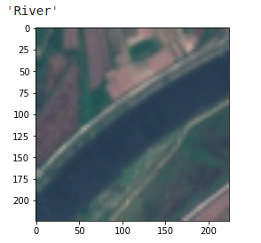
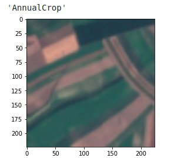
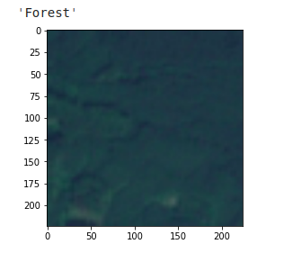
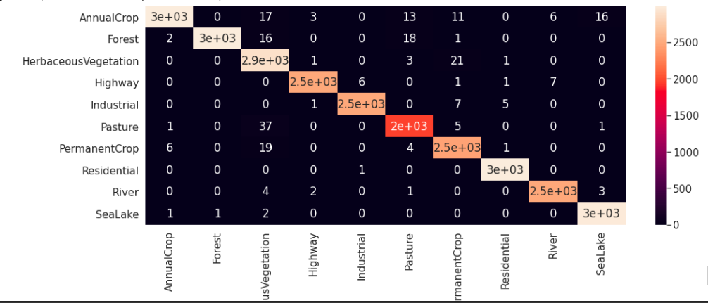

# Multispectral-Land-Cover-Classification
Multispectral-Land-Cover-Classification App using deep learning along with transfer learning (Resnet50) and EuroSAT dataset

For implementation:

* Run the notebook to generate the model.
* Dataset can be downloaded from the link [here](https://github.com/phelber/eurosat). 
* Save model in the Models directory
* Install required packages
* Run app.py (browse an image to load and the app wil show you its class).

### Work plan
To increase accuracy and speed up training in this case, deep learning and transfer learning are used. The framework for our deep learning model will be __Pytorch__.
This dataset is available at https://github.com/phelber/eurosat. The data set is offered in both ".tiff" and "image" formats. We chose RGB because pretrained models are already trained on RGB photos so we can take the image dataset and work on it. Since they provided multi spectral data with 13 different spectrum, the ".tiff" format may be utilized to extract other spectral information.

We have to create the dataset class, transformations and dataloaders. We created a EuroSAT dataset class inherited from torch dataset library. Creating our own method to get data which takes the name of the file and taking it from each directory. We also add transforms as some data augmentation and preprocessing stepfor using it with the pretrained model. Then we create dataset and data loader for training and validation with the preferred batch_size, feel free to experiment with more transformation which might help you to improve accuracy.

For creating the model. We use transfer learning, here we use __wide_resnet50_2__ model as a pretrained model which is already trained on a huge image dataset. We change the classification layer of wide_resnet50_2 with some additional sequential layers for fine tuning. This added layer includes Linear layer(n_inputs, 256) => ReLU layer => Dropout Layer => Linear Layer (256, num_classes) => LogSoftmax layer In the model class we also include freeze and unfreeze function in order to select training the whole architecture or only the classification layer we added.

We trained the model for 10 epochs and save the best model based on the accuracy and losses.

### Dataset
1. EuroSAT dataset is open sourced.
2. It consist of satellite images RGB and multi spectral - covering 13 spectral bands (including visible, newar infrared, shortwave infrared) with 10 unique classes.
3. It consist of 27000 labeled and geo-referenced images.
4. The dataset is published and benchmarked with CNN by a paper titled EuroSAT: A Novel Dataset and Deep Learning Benchmark for Land Use and Land Cover Classification and they have made dataset public through this repo.

The authors were able to sort out some common issues that come up with studying satellite data and were able to sort it out for land use and land cover classification.

* Cloud appearence
* Color casting due to atmospheric effects
* Dead/pixels
* Ice or snow

### Results

Below shows the graph of __accuracy__ and __losses__ against __epochs__ for both training and testing data.

Some __prediction results__ are shown below

__Confusion Matrix__ 

__APP__ 

